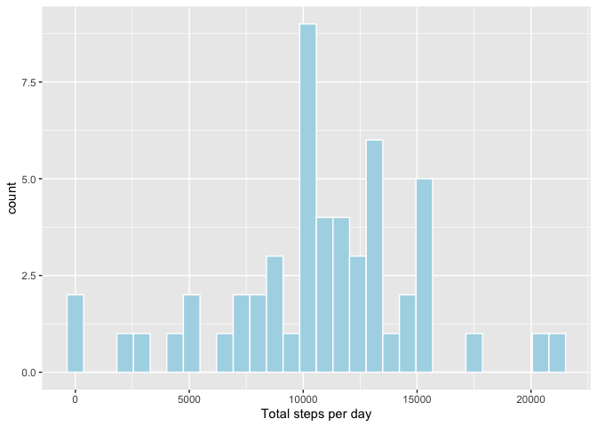
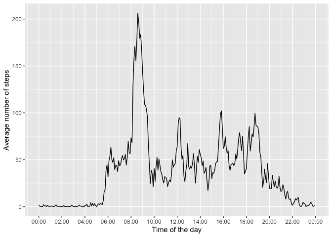
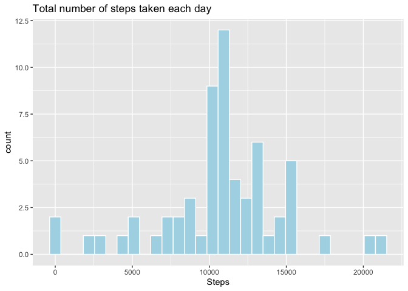
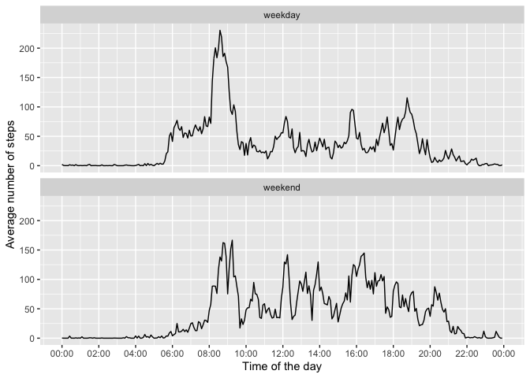

## Introduction
Throughout the document, packages from *tidyverse* set of packages are used.
If the document is going to be run locally, make sure the necessary packages 
are installed. The easiest way to install them is to install *tidyverse*
metapackage.

```r
install.packages("tidyverse")
```
Alternatively, install them individually.

```r
install.packages("readr")
install.packages("dplyr")
install.packages("ggplot2")
```

Most likely, installation will not be required and the packages are already 
installed, but it was worth noting any way.

## Loading and preprocessing the data

Loading necessary libraries:

```r
suppressMessages({
    library(readr)
    library(dplyr)
    library(ggplot2)
})
```
Read the raw dataset from the file:

```r
# raw dataset
activity <- read_csv("activity.zip", 
                     col_types = cols(date = col_date(format = "%Y-%m-%d"), 
                                      interval = col_number(), 
                                      steps = col_number()))
```


## What is mean total number of steps taken per day?

```r
# activity per day
daily_activity <- activity %>% group_by(date) %>% summarise(steps = sum(steps))
# plot of the total number of steps per day
ggplot(daily_activity, aes(x = steps)) + 
    geom_histogram(fill = "lightblue", colour = "white", bins = 30, 
                   na.rm = TRUE) +
    xlab("Total steps per day")
```

<!-- -->

The mean total number of steps per day is

```r
mean(daily_activity$steps, na.rm = TRUE)
```

```
## [1] 10766.19
```

The median number of steps per day is

```r
median(daily_activity$steps, na.rm = TRUE)
```

```
## [1] 10765
```


## What is the average daily activity pattern?
Below you can see the time series plot of the average number of steps taken
in the certain time of the day. 
Actual time is used in the x-axis instead of interval code for presentation.

```r
# activity per interval with an added time column
interval_activity <- activity %>% group_by(interval) %>% 
  summarise(average_steps = mean(steps, na.rm = TRUE)) %>%
  mutate(time = as.POSIXct(strptime(sprintf("%04d", interval), "%H%M")))

# plot average activity per interval
ggplot(interval_activity, aes(x = time, y = average_steps)) +
  geom_line() + 
  scale_x_datetime(date_labels = "%H:%M", date_breaks = "2 hours") +
  xlab("Time of the day") + 
  ylab("Average number of steps")
```

<!-- -->


```r
# dataset with the maximum number of steps
max_interval <- interval_activity %>% 
  filter(average_steps == max(average_steps))
# the following variables are inlined in the text statement below
max_average_steps <- sprintf("%.0f", max_interval$average_steps)
max_time <- format(max_interval$time, format="%H:%M")

# Text below is generated as:
# The interval when the most number of steps (`r max_average_steps` on average) 
# happens at `r max_time`.
```


The interval when the most number of steps (206 on average) 
happens at 08:35.

## Imputing missing values
Total number of the missing values in the dataset:

```r
activity %>% filter_all(any_vars(is.na(.))) %>% count() %>% pull()
```

```
## [1] 2304
```
I am going to use "average per the 5-minute interval" strategy for filling in 
missing values as the most reasonable one in my opinion.

```r
# clean version of activity dataset with NAs filled in
activity <- activity %>% group_by(interval) %>% 
  mutate(steps = tidyr::replace_na(steps, mean(steps, na.rm = TRUE))) %>% ungroup()
# activity per day
daily_activity <- activity %>% group_by(date) %>% summarise(steps = sum(steps))
# histogram of the total number of steps taken each day
ggplot(daily_activity, aes(x = steps)) + 
    geom_histogram(fill = "lightblue", colour = "white", bins = 30, 
                   na.rm = TRUE) +
    xlab("Steps") +
    ggtitle("Total number of steps taken each day")
```

<!-- -->

The mean total number of steps per day is

```r
mean(daily_activity$steps)
```

```
## [1] 10766.19
```

The median number of steps per day is

```r
median(daily_activity$steps)
```

```
## [1] 10766.19
```

As we can see, the strategy of replacing missing values with their averages 
per interval led to a distribution not much dissimilar to the one with
missing values removed, but more centered around the mean.

Mean and median of the original distribution were not much different 
in the first place, replacing missing values with averages made them identical.

## Are there differences in activity patterns between weekdays and weekends?

Here is the plot showing average number of steps taken in different times
of the day across weekdays and weekends.
Actual time is used in the x-axis instead of interval code for presentation.

```r
# adding a day_type factor
activity <- activity %>% mutate(day_type = as.factor(
  if_else(as.POSIXlt(date)$wday %in% c(0,6), "weekend", "weekday")))

# aggregating steps per interval and adding time column
interval_activity <- activity %>% group_by(day_type, interval) %>% 
  summarise(average_steps = mean(steps)) %>% 
  mutate(time = as.POSIXct(strptime(sprintf("%04d", interval), "%H%M")))

# panel plot
ggplot(interval_activity, aes(x = time, y = average_steps)) + 
  geom_line() +
  facet_wrap(~ day_type, dir = "v") +
  scale_x_datetime(date_labels = "%H:%M", date_breaks = "2 hours") +
  xlab("Time of the day") + 
  ylab("Average number of steps")
```

<!-- -->

